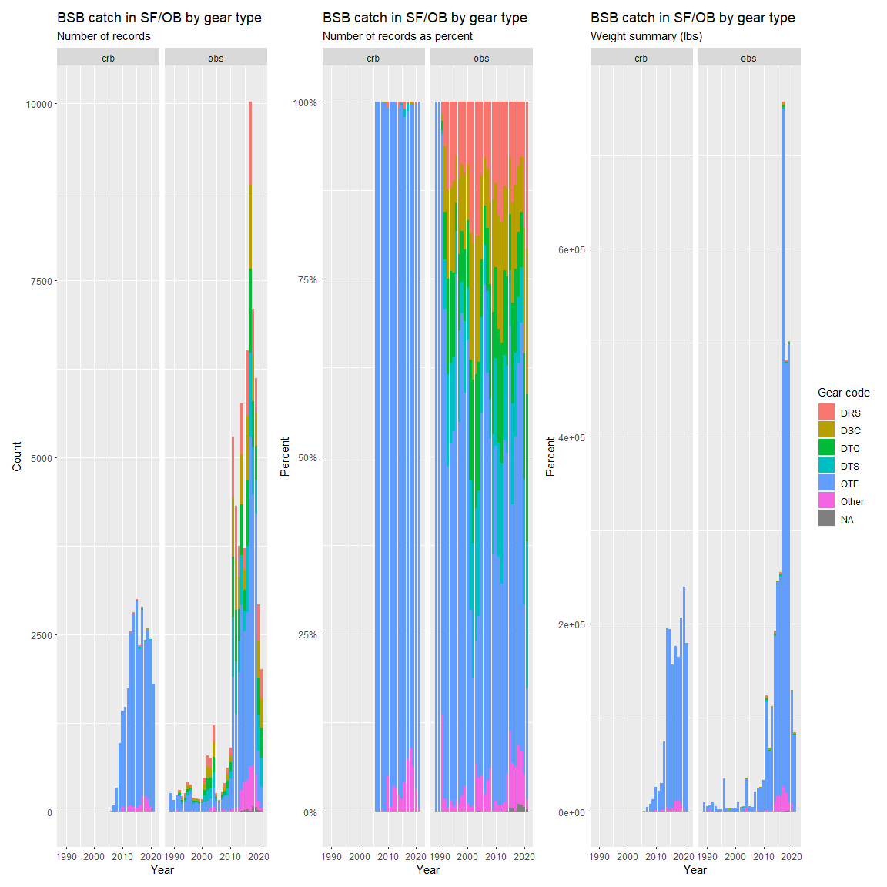

BSB\_pull\_only
================
Andy Jones
10/13/2021

# Description

This is an example of a github document knitted from the Rmd file. It
takes one extra file to make a database connection, but otherwise is
self contained. It goes to the observer database as well as the Study
Fleet database to find information that is available. Here all gears are
brought in. The focus is on pulling information that could be useful for
a CPUE estimate for black seabass.

\[Black Sea Bass\]
(<https://media.fisheries.noaa.gov/styles/original/s3/dam-migration/640x427-black-sea-bass.png?itok=7Ax8suz_>)

# Setting global options

# Loading packages

Loading the many packages that are used somewhere in this script. This
script has evolved to do many things and many of these are only need in
one or two places.

``` r
#loading needed packages
#Not all of these are needed right away
library(tidyverse)
library(lubridate) #dates
library(MASS)
```

# Setting up DB connection

Setting up connections to SOLE and NOVA using ROracle.

``` r
#File path may need to change
source('C:/Users/andrew.jones/Desktop/dbconnection_v1.R')
```

# CRB data pull

Pulling the CRB data as well as a couple of other tables. This includes
the CRB trip, effort, and catch data. Conversion factors from CFDBS and
VTR gear codes. Also a VERS trip list for the CRB data. At the bottom it
sticks all of these things together into a data frame to work from.

``` r
###########################
###########################
#Setting the role so I can access the FVTR schema
dbGetQuery(con,"SET ROLE SFLT_SELECT_ROLE, FVTR_SELECT_ALL_ROLE")
```

    ## [1] TRUE

``` r
dbGetQuery(con,"SET ROLE ALL")
```

    ## [1] TRUE

``` r
#Pulling small tables of extra things
#getting conversion factors (not the best table but what's in FVTR)
conversion_factors_cfdbs <- dbGetQuery(con,"select * from CFDBS.SPECIES_ITIS_NE")
conversion_factors_cfdbs_nespp4 <- dbGetQuery(con,"select * from CFDBS.SPECIES_ITIS_VTR_NESPP4")

#getting conversion factors (not the best table but what's in FVTR)
conversion_factors_vers <- dbGetQuery(con,"select * from FVTR.VERS_APPORTION_CONV_TO_CATCH")


#getting gear codes
vtr_gear_codes <- dbGetQuery(con,"select * from VTR.VLGEAR")

###########################
###########################

#Pulling the VERS Trip List View
#This excludes trips reported by Carlos R. vessels, trips with errors and those there were part of research/EFPs
trip_list <- dbGetQuery(con,"select * from FVTR.VERS_TRIP_LIST where deleted=0 and moved_status_flag in ('M','L') and trip_category = 1 and CRB_EXCL = 0")

###########################
###########################

#Getting the catch, effort, landing, and trip data
#Catch and discard info
stflt_catch <- dbGetQuery(con,"select * from FVTR.STFLT_CATCH")
ncrp_catch <- dbGetQuery(con,"select * from FVTR.NCRP_VERS_CATCH")

crpp_catch <- bind_rows(stflt_catch %>% mutate(SOURCE='STFLT'),
                         ncrp_catch %>% mutate(SOURCE='NCRP'))

#Effort and gear info
stflt_effort <- dbGetQuery(con,"select * from FVTR.STFLT_EFFORT")
ncrp_effort <- dbGetQuery(con,"select * from FVTR.NCRP_VERS_EFFORT")

crpp_effort <- bind_rows(stflt_effort %>% mutate(SOURCE='STFLT'),
                     ncrp_effort %>% mutate(SOURCE='NCRP'))

#Sail date info (in GMT)
stflt_trip <- dbGetQuery(con,"select * from FVTR.STFLT_TRIP")
ncrp_trip <- dbGetQuery(con,"select * from FVTR.NCRP_VERS_TRIP")

crpp_trip <- bind_rows(stflt_trip %>% mutate(SOURCE='STFLT'),
                   ncrp_trip %>% mutate(SOURCE='NCRP'))


#Sail date info (in GMT)
stflt_trip_dd <- dbGetQuery(con,"select * from FVTR.STFLT_TRIP_DD where dd_element_name in ('TARGET SPECIES','VTR SERIAL NUMBER')")
ncrp_trip_dd <- dbGetQuery(con,"select * from FVTR.NCRP_VERS_TRIP_DD where dd_element_name in ('TARGET SPECIES','VTR SERIAL NUMBER')")

crpp_trip_dd <- bind_rows(stflt_trip_dd %>% mutate(SOURCE='STFLT'),
                   ncrp_trip_dd %>% mutate(SOURCE='NCRP'))

#getting gear codes
fvtr_gear_codes <- dbGetQuery(con,"select * from FVTR.FVTR_GEAR_CODES")

#Pulling vessel data
vps_vessels <- dbGetQuery(con,"select * from PERMIT.VPS_VESSEL")

#Making my own version of the vessel data
vessel_info <- vps_vessels %>%
  dplyr::select(VES_NAME,AP_YEAR,VP_NUM,HULL_ID,PPORT,HPORT,PPST,LEN,CREW,GTONS,NTONS,VHP,BLT,HOLD,TOC,TOP) %>%
  group_by(VES_NAME,AP_YEAR,VP_NUM,HULL_ID) %>% slice(1)

#CRB GTE data
#gte_join <- dbGetQuery(con,"select * from NERS.GTE_JOIN")
#gte_effort <- dbGetQuery(con,"select * from NERS.GTE_EFFORTS")

#Putting this all together
#And then subsetting down to the Haul-by-haul records
pulled_data <- trip_list %>% 
  dplyr::select(TRIP_ID,VESSEL_PERMIT_NUM,VESSEL_HULL_ID,VESSEL_NAME,SAIL_DATE_LCL,
         REPORT_SOURCE,EVTR,SECTOR,STFLT,EM) %>% 
  inner_join(.,crpp_effort %>% 
              mutate(TRIP_ID=as.character(TRIP_ID))) %>% 
  mutate(EFFORT_ID=paste(TRIP_ID,EFFORT_NUM)) %>%
  inner_join(., crpp_catch %>% mutate(TRIP_ID=as.character(TRIP_ID)) %>%
               dplyr::select(TRIP_ID,EFFORT_NUM,SPECIES_ITIS,GRADE_CODE,
                             MARKET_CODE,HAIL_AMOUNT_UOM,
                      HAIL_AMOUNT,DISPOSITION_CODE) %>%
               mutate(EFFORT_ID=paste(TRIP_ID,EFFORT_NUM))) %>% 
  mutate(AREA_CODE = as.numeric(as.character(FA_AREA_CODE))) %>%
  mutate(AREA_FISHED=case_when(AREA_CODE<=599 ~ 'NE',AREA_CODE>=600 ~ 'MA')) %>%
  inner_join(.,fvtr_gear_codes %>%
               dplyr::select(GEAR_CODE,VTR_GEAR_CODE,ACCSP_GEAR_CODE),
             by=c('GC_GEAR_CODE'='GEAR_CODE')) %>%
  mutate(QUARTER=quarter(SAIL_DATE_LCL),YEAR=year(SAIL_DATE_LCL)) %>%
  filter(REPORT_SOURCE=='HBH')
```

# Making functions to convert the CRB lat/lon data

Converting the decimal degree minutes format in the CRB data to decimal
degrees.

``` r
#SOURCE FOR FUNCTIONS
#Making a function to convert dmm to dd for LAT
LAT_convert <- function(x) {
  result <- vector()
  for(i in 1:length(x)){
  if(!is.na(x[i])) {
   a <- as.numeric(str_sub(x[i],start=1,end=2))
   b <- as.numeric(str_sub(x[i],start=3,end=4))/60
   c <- as.numeric(str_sub(x[i],start=5,end=9))/60
   result[i] <- a+b+c} else {result[i] <- 'NA'}}
  return(result)
}

#Making a function to convert dmm to dd for LON
LON_convert <- function(x) {
  result <- vector()
  for(i in 1:length(x)){
  if(!is.na(x[i])) {
   a <- as.numeric(str_sub(x[i],start=2,end=3))
   b <- as.numeric(str_sub(x[i],start=4,end=5))/60
   c <- as.numeric(str_sub(x[i],start=6,end=10))/60
   result[i] <- -1*(a+b+c)} else {result[i] <- 'NA'}}
  return(result)
}

#Testing the function
#https://3planeta.com/gps-tools/longitude-latitude.html
#Test DMM
#3952.719248581974654
#-7310.417112840237905

lat_ex <-3952.71924
lon_ex <- -7310.41711

#Answers
#39.87865414303291
#-73.1736185473373

#Running the functions
LAT_convert(lat_ex)
```

    ## [1] 39.87865

``` r
LON_convert(lon_ex)
```

    ## [1] -73.17362

``` r
#Applying the function to the columns of interest
pulled_data_edit <- pulled_data %>%
  mutate(START_HAUL_LAT = LAT_convert(START_HAUL_LAT),END_HAUL_LAT = LAT_convert(END_HAUL_LAT),
         START_SET_LAT = LAT_convert(START_SET_LAT),END_SET_LAT = LAT_convert(END_SET_LAT),
         START_HAUL_LON = LON_convert(START_HAUL_LON),END_HAUL_LON = LON_convert(END_HAUL_LON),
         START_SET_LON = LON_convert(START_SET_LON),END_SET_LON = LON_convert(END_SET_LON))
```

# Pulling the observer data

Pulling the OB and ASM data tables for trip, haul, and catch data. This
is just for trawl gears here.

``` r
#Getting the Observer Data (all years)
#getting gear codes
obdbs_gear_codes <- dbGetQuery(con,"select * from obdbs.obgear")
OBTRG <- dbGetQuery(con.nova,"select * from obdbs.obtrg")
OBMESHSIZE <- dbGetQuery(con.nova,"select * from obdbs.OBMESHSIZE")
OBOTGH <- dbGetQuery(con.nova,"select * from obdbs.OBOTGH")
OBTWTHUNG <- dbGetQuery(con.nova,"select * from obdbs.OBTWTHUNG")

#ASM and OBS trip data
OBTRP <- dbGetQuery(con.nova, "select * from OBDBS.OBTRP")
ASMTRP <- dbGetQuery(con.nova, "select * from OBDBS.ASMTRP")

#ASM and OBS HAUL data for all gears
OBHAU <- dbGetQuery(con.nova, "select * from OBDBS.OBHAU")
ASMHAU <- dbGetQuery(con.nova, "select * from OBDBS.ASMHAU")

# #ASM and OBS haul data for trawl gear
# OBHAU <- dbGetQuery(con.nova, "select * from OBDBS.OBHAU where negear in('050','051','052','053','054','056','057','058','170','370')")
# ASMHAU <- dbGetQuery(con.nova, "select * from OBDBS.ASMHAU where negear in('050','051','052','053','054','056','057','058','170','370')")

#ASM and 
OBSPP <- dbGetQuery(con.nova, "select * from OBDBS.OBSPP")
ASMSPP <- dbGetQuery(con.nova, "select * from OBDBS.ASMSPP")
OBSPEC <- dbGetQuery(con.nova, "select * from OBDBS.OBSPEC")
```

# Subsetting the Observer data

Only bringing in specific columns and records from OBHAU. Bringing the
ASM and OB tables together.

# Polishing the Obs data

Converting landed weight to live weight and summarizing catch for the
species of interest (discards, kept, and total).

``` r
#Converting the reported weights using conversion factors
ASM_OB_CATCH_SUB_edit_cf <- ASM_OB_CATCH_SUB %>% dplyr::select(-SPECIES_ITIS) %>%
                      left_join(.,conversion_factors_cfdbs_nespp4 %>%
                                    group_by(SPECIES_ITIS,
                                             NESPP4,
                                             COMMON_NAME) %>%
                                    summarise(CF_LANDED_LIVE=mean(CF_LANDED_LIVE,na.rm=TRUE),
                                              CF_QTY_LANDED=mean(CF_QTY_LANDED,na.rm=TRUE)),
                                    by=c('NESPP4'='NESPP4')) %>%
                       mutate(HAIL_AMOUNT_LB =  HAILWT * CF_LANDED_LIVE * CF_QTY_LANDED)

#Calculating the amount of BSB for each catch record
#Will be zero for hauls without BSB
#changed hail column because no unit conversion
ASM_OB_CATCH_SUB_edit_sum <- ASM_OB_CATCH_SUB_edit_cf %>%
  mutate(BSB_KEPTWT = case_when(SPECIES_ITIS==  '167687' & CATDISP == '1' ~ HAIL_AMOUNT_LB,TRUE ~ 0),
         BSB_DISCARDTWT = case_when(SPECIES_ITIS==  '167687' & CATDISP == '0' ~ HAIL_AMOUNT_LB,TRUE ~ 0),
         SUM_BSB_CATCH = BSB_KEPTWT + BSB_DISCARDTWT)

#Adding a trip total  
ASM_OB_CATCH_SUB_edit_cf_tot <- ASM_OB_CATCH_SUB_edit_sum %>% group_by(LINK1) %>% 
                                      mutate(TOT_CATCH = sum(HAIL_AMOUNT_LB,na.rm=TRUE),
                                             TOT_BSB_CATCH=sum(SUM_BSB_CATCH,na.rm=TRUE)) %>% ungroup()

#Summarizing the data to the haul level
#Calculates the total catch weight for the haul
ASM_OB_CATCH_SUB_edit_sum_sum <- ASM_OB_CATCH_SUB_edit_cf_tot %>% 
                          group_by(LINK1,LINK3,DATESAIL,PERMIT1,HULLNUM1,YEAR,MONTH,TRIPID,HAULNUM,
                                   AREA,NEMAREA,NEGEAR,OBSRFLAG,LATHBEG,LONHBEG,
                                   HAUCOMMENTS,DATEHBEG,DATEHEND,
                                   GIS_LATHBEG,GIS_LATHEND,GIS_LONHBEG,GIS_LONHEND,HAULDUR,DEPTH,TOT_CATCH,TOT_BSB_CATCH,
                                   TARGSPEC1
                                   #GEAR_SIZE,MESH_SIZE,MESH_TYPE,MESH_SIZE_AB,CODCAT,NUM_HAULS,SOAK_DURATION_DH
                                   ) %>% 
                                   summarise(BSB_KEPTWT = sum(BSB_KEPTWT,na.rm=TRUE),
                                             BSB_DISCARDTWT = sum(BSB_DISCARDTWT,na.rm=TRUE),
                                             SUM_BSB_CATCH = sum(SUM_BSB_CATCH,na.rm=TRUE)
                                             )

#Adding mesh size
ASM_OB_CATCH_SUB_edit_sum_sum_ms <- ASM_OB_CATCH_SUB_edit_sum_sum %>% left_join(.,OBOTGH %>% dplyr::select(LINK3,CODMSIZE,FTROPLEN,CODHUNG) %>%  group_by(LINK3,FTROPLEN,CODMSIZE) %>% slice(1) %>% mutate(CODMSIZE=CODMSIZE*0.0393701)) %>% ungroup() %>%
  mutate(CODHUNG=case_when(CODHUNG==0~'UNKNOWN',CODHUNG==1~'DIAMOND',CODHUNG==2~'SQUARE',CODHUNG==3~'SQUARE WRAPPED',CODHUNG==8~'SQUARE WRAPPED'))


####NEED TO ADD
#Adding target species name
#ASM_OB_CATCH_SUB_edit_sum_sum_ms
```

# Polishing the CRB data

Changing the depth variable to be in fathoms, converting landed weight
to live weight, summarizing catch for the species of interest (discards,
kept, and total).

``` r
#Converting depth to meters
pulled_data_edit <- pulled_data_edit %>% mutate(DEPTH = as.numeric(DEPTH),
                            DEPTH_CONV = case_when(DEPTH_UOM == 'FT' ~ 0.166667,
                                            DEPTH_UOM == 'M' ~ 0.54680774278,
                                            TRUE ~ 1),
                            DEPTH = DEPTH * DEPTH_CONV)

#Converting the reported weights using conversion factors
pulled_data_edit_cf <- pulled_data_edit %>%
                      left_join(.,conversion_factors_cfdbs %>%
                                    dplyr::select(SPECIES_ITIS,
                                           GRADE_CODE,
                                           MARKET_CODE,
                                           UNIT_OF_MEASURE,
                                           COMMON_NAME,
                                           GRADE_DESC,
                                           MARKET_DESC,
                                           NESPP4,
                                           CF_LNDLB_LIVLB,
                                           CF_RPTQTY_LNDLB),
                                    by=c('SPECIES_ITIS'='SPECIES_ITIS',
                                    'GRADE_CODE'='GRADE_CODE',
                                    'MARKET_CODE'='MARKET_CODE',
                                    'HAIL_AMOUNT_UOM'='UNIT_OF_MEASURE')) %>%
                       mutate(HAIL_AMOUNT_LB = case_when(HAIL_AMOUNT_UOM!='COUNT' ~ HAIL_AMOUNT * CF_LNDLB_LIVLB,
                                                         TRUE ~ HAIL_AMOUNT * CF_RPTQTY_LNDLB))
                    
#Calculating the amount of Atl BSB for each catch record
#Will be zero for hauls without Atl BSB
#changed hail column because no unit coversion
pulled_data_cf_sum <-pulled_data_edit_cf %>%
  mutate(BSB_KEPTWT = case_when(SPECIES_ITIS==  '167687' & DISPOSITION_CODE == '011' ~ HAIL_AMOUNT_LB,TRUE ~ 0),
         BSB_DISCARDTWT = case_when(SPECIES_ITIS==  '167687' & DISPOSITION_CODE == '100' ~ HAIL_AMOUNT_LB,TRUE ~ 0),
         SUM_BSB_CATCH = BSB_KEPTWT + BSB_DISCARDTWT)

#Adding a trip total  
pulled_data_cf_tot <- pulled_data_cf_sum %>% group_by(TRIP_ID) %>% 
                                    mutate(TOT_CATCH = sum(HAIL_AMOUNT_LB,na.rm=TRUE),
                                           TOT_BSB_CATCH = sum(SUM_BSB_CATCH,na.rm=TRUE)) %>% ungroup()
#Summarising the data to the haul level
#Calculates the total catch weight for the haul
pulled_data_cf_sum_sum <- pulled_data_cf_tot %>% 
                          mutate(EFFORT_ID=paste(TRIP_ID,EFFORT_NUM,sep=' ')) %>%
                          group_by(SOURCE,REPORT_SOURCE,TRIP_ID,EFFORT_ID,VESSEL_PERMIT_NUM,VESSEL_HULL_ID,VESSEL_NAME,
                                   ACCSP_GEAR_CODE,VTR_GEAR_CODE,AREA_CODE,SAIL_DATE_LCL,
                                   QUARTER,YEAR,EVTR,SECTOR,STFLT,EM,
                                   EFFORT_NUM,END_SET_LAT,END_SET_LON,START_HAUL_LAT,
                                   START_HAUL_LON,END_HAUL_DATE_GMT,END_HAUL_LAT,END_HAUL_LON,
                                   DEPTH,DEPTH_UOM,GEAR_QUANTITY,
                                   GEAR_SIZE,MESH_SIZE,MESH_TYPE,#MESH_SIZE_AB,CODCAT,
                                   NUM_HAULS,SOAK_DURATION_DH,TOT_CATCH,TOT_BSB_CATCH) %>% 
                                   summarise(BSB_KEPTWT = sum(BSB_KEPTWT,na.rm=TRUE),
                                             BSB_DISCARDTWT = sum(BSB_DISCARDTWT,na.rm=TRUE),
                                             SUM_BSB_CATCH = sum(SUM_BSB_CATCH,na.rm=TRUE)
                                             )

#Adding targeting
#Also translating mesh type to a description
pulled_data_cf_sum_sum_tg <- pulled_data_cf_sum_sum %>%
  left_join(.,crpp_trip_dd %>% dplyr::select(TRIP_ID,DD_ELEMENT_NAME,DD_ELEMENT_VALUE) %>%
              filter(DD_ELEMENT_NAME=='TARGET SPECIES') %>% mutate(TRIP_ID=as.character(TRIP_ID))) %>%
  mutate(MESH_TYPE=case_when(MESH_TYPE==1~'DIAMOND',MESH_TYPE==0~'SQUARE'))
```

# Combining the two data set

Making the columns the same so I can bring things together with just a
simple row bind.

``` r
#Subsetting the study fleet data down to specific columns
pulled_data_cf_sum_sum_sub <- pulled_data_cf_sum_sum_tg %>% ungroup() %>% mutate(hull_num=NA) %>%
                                                    dplyr::select(permit=VESSEL_PERMIT_NUM,area=AREA_CODE,
                                                                trip_id=TRIP_ID,
                                                                hull_num=hull_num,
                                                                haul_num=EFFORT_NUM,
                                                                haul_id=EFFORT_ID,
                                                                sail_date=SAIL_DATE_LCL,
                                                                start_lat=END_SET_LAT,
                                                                start_lon=END_SET_LON,
                                                                end_lat=START_HAUL_LAT,
                                                                end_lon=START_HAUL_LON,
                                                                depth=DEPTH,
                                                                effort_dur=SOAK_DURATION_DH,
                                                                gear_code=VTR_GEAR_CODE,
                                                                mesh_size=MESH_SIZE,
                                                                mesh_type=MESH_TYPE,
                                                                gear_size=GEAR_SIZE,
                                                                target=DD_ELEMENT_VALUE,
                                                                BSB_KEPTWT,
                                                                BSB_DISCARDTWT,
                                                                SUM_BSB_CATCH,
                                                                TOT_CATCH,
                                                                TOT_BSB_CATCH) %>% 
                                                      mutate(source='crb') %>%
                                                      mutate(start_lat=as.numeric(as.character(start_lat)),
                                                                start_lon=as.numeric(as.character(start_lon)),
                                                                end_lat=as.numeric(as.character(end_lat)),
                                                                end_lon=as.numeric(as.character(end_lon)))

#adding a shared gear column
pulled_data_cf_sum_sum_sub <- pulled_data_cf_sum_sum_sub %>% left_join(.,vtr_gear_codes %>% 
                                                                 dplyr::select(GEARCODE,NEGEAR) %>% 
                                                                 distinct() %>% drop_na() %>% arrange(GEARCODE) %>% 
                                                                 group_by(GEARCODE) %>% top_n(1),
                                                                 by=c('gear_code'='GEARCODE')) %>%
                                                                 dplyr::rename(gear_code_vtr=gear_code,
                                                                            gear_code_obs=NEGEAR)

#Subsetting the observer data down
ASM_OB_CATCH_SUB_edit_sum_sum_sub <- ASM_OB_CATCH_SUB_edit_sum_sum_ms %>% ungroup() %>% 
                                        dplyr::select(permit=PERMIT1,hull_num=HULLNUM1,area=AREA,
                                                                trip_id=LINK1,
                                                                haul_id=LINK3,
                                                                haul_num=HAULNUM,
                                                                sail_date=DATESAIL,
                                                                start_lat=GIS_LATHBEG,
                                                                start_lon=GIS_LONHBEG,
                                                                end_lat=GIS_LATHEND,
                                                                end_lon=GIS_LONHEND,
                                                                depth=DEPTH,
                                                                effort_dur=HAULDUR,
                                                                gear_code=NEGEAR,
                                                                mesh_size=CODMSIZE,
                                                                mesh_type=CODHUNG,
                                                                gear_size=FTROPLEN,
                                                                target=TARGSPEC1,
                                                                BSB_KEPTWT,
                                                                BSB_DISCARDTWT,
                                                                SUM_BSB_CATCH,
                                                                TOT_CATCH,
                                                                TOT_BSB_CATCH) %>% 
                                                      mutate(source='obs') %>%
                                                      mutate(start_lat=as.numeric(start_lat),
                                                                start_lon=as.numeric(start_lon),
                                                                end_lat=as.numeric(end_lat),
                                                                end_lon=as.numeric(end_lon))

#adding a shared gear column
ASM_OB_CATCH_SUB_edit_sum_sum_sub <- ASM_OB_CATCH_SUB_edit_sum_sum_sub %>% left_join(.,vtr_gear_codes %>% 
                                                                 dplyr::select(GEARCODE,NEGEAR) %>% 
                                                                   distinct() %>% drop_na() %>% arrange(GEARCODE),
                                                               by=c('gear_code'='NEGEAR')) %>%
                                                              dplyr::rename(gear_code_vtr=GEARCODE,
                                                                            gear_code_obs=gear_code)


#putting the data sets together
combined_data <- rbind(pulled_data_cf_sum_sum_sub,ASM_OB_CATCH_SUB_edit_sum_sum_sub) %>% mutate(haul_num=as.numeric(haul_num))
```

\#\#Data polishing 2 (inspecting and weeding out co-sampled trips)
Matching observer and cooperative research trips by permit and date,
then comparing the total catch of BSB on a given trip between the two
data sources. Need to make sure the observer trips without a permit
number get accounted for too. Needs imporvement.

``` r
#Making a polished data frame (pulling out some records with extreme values)
#Putting together the other data
plot_data <- combined_data %>%
  mutate(TRIPID_EFFORT=paste(trip_id,haul_num,sep='_')) %>%
  mutate(YEAR=year(sail_date),
         MONTH=month(sail_date),
         YDAY=yday(sail_date),
         DATE=as.Date(sail_date))

#Looking at the number of 'matching' trips
trip_count <- plot_data %>% dplyr::select(permit,trip_id,DATE) %>% distinct() %>% group_by(permit,DATE) %>% tally(n='TRIP_COUNT')

#Adding a count of the number of trip records for each permit and day
plot_data <- plot_data %>% left_join(.,trip_count)

#Weeeding out co-sampled trips (hopefully)
plot_data_single_rec <- plot_data %>% filter(TRIP_COUNT==1)
plot_data_more_rec <- plot_data %>% filter(TRIP_COUNT > 1) %>% group_by(permit,DATE,haul_num) %>% sample_n(1) %>% ungroup()

plot_data_comb <- rbind(plot_data_single_rec,plot_data_more_rec)
```

# Adding vessel information

This come from GARFO and is messy. Each vessel has an entry per year in
the VPS vessels table. Need to run past Ben and co.

``` r
##Adding vessel info
plot_data_comb_ves_1 <- plot_data_comb %>% filter(!is.na(permit)) %>% left_join(.,vessel_info %>% mutate(VP_NUM=as.character(VP_NUM)) %>% ungroup() %>% dplyr::select(VES_NAME,AP_YEAR,VP_NUM,PPORT,GTONS,VHP) %>% distinct() %>% group_by(VP_NUM,AP_YEAR) %>% slice(1) %>% ungroup(),by=c("permit"="VP_NUM","YEAR"="AP_YEAR"))

plot_data_comb_ves_2 <- plot_data_comb %>% filter(is.na(permit)) %>% left_join(.,vessel_info %>% mutate(VP_NUM=as.character(VP_NUM)) %>% dplyr::select(VES_NAME,AP_YEAR,VP_NUM,PPORT,GTONS,VHP) %>% ungroup(), by=c("hull_num"="HULL_ID","YEAR"="AP_YEAR"))

#Actually writing a data file
#write_rds(bind_rows(plot_data_comb_ves_1,plot_data_comb_ves_2),'C:/Users/andrew.jones/Desktop/BSB_sf_ob_v1.rds')
```

# Making plots of the data we’ve brought together

``` r
#plotting things out just to see where the records are from
a <- ggplot() + 
  geom_bar(data=bind_rows(plot_data_comb_ves_1,plot_data_comb_ves_2) %>% filter(SUM_BSB_CATCH>0) %>% 
             group_by(gear_code_vtr,source,YEAR) %>% tally() %>%
             ungroup() %>%
             mutate(gear_code_trim=fct_lump(gear_code_vtr,5)),
                  aes(x=YEAR,y=n,fill=gear_code_trim),
                  stat='identity') +
  facet_wrap(~source) +
  labs(title='BSB catch in SF/OB by gear type',subtitle = 'Number of records',x='Year',y='Count') +
  theme(legend.position = "none")

b <- ggplot() + 
  geom_bar(data=bind_rows(plot_data_comb_ves_1,plot_data_comb_ves_2) %>% filter(SUM_BSB_CATCH>0) %>% 
             mutate(gear_code_trim=fct_lump(gear_code_vtr,5)),
                  aes(x=YEAR,fill=gear_code_trim),
                  position = "fill") +
  facet_wrap(~source) +   scale_y_continuous(labels = scales::percent) +
  labs(title='BSB catch in SF/OB by gear type',subtitle = 'Number of records as percent',x='Year',y='Percent') +
  theme(legend.position = "none")

c <- ggplot() + 
  geom_bar(data=bind_rows(plot_data_comb_ves_1,plot_data_comb_ves_2) %>% filter(SUM_BSB_CATCH>0) %>% 
             group_by(gear_code_vtr,source,YEAR) %>% summarise(BSB_sum=sum(SUM_BSB_CATCH,na.rm=TRUE)) %>%
             ungroup() %>%
             mutate(gear_code_trim=fct_lump(gear_code_vtr,5)),
                  aes(x=YEAR,y=BSB_sum,fill=gear_code_trim),
                  stat='identity') +
  facet_wrap(~source) +
  labs(title='BSB catch in SF/OB by gear type',subtitle = 'Weight summary (lbs)',x='Year',y='Percent',fill='Gear code')

library(patchwork)

a + b + c
```

<!-- -->
